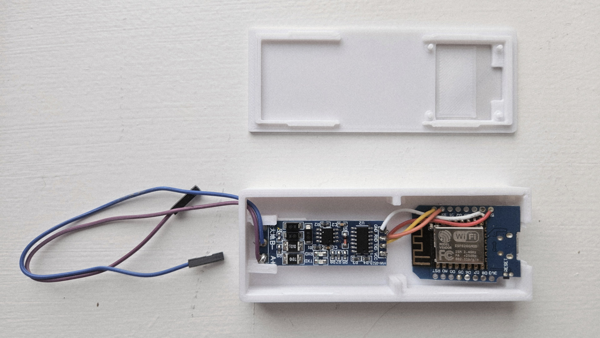
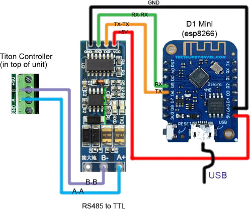
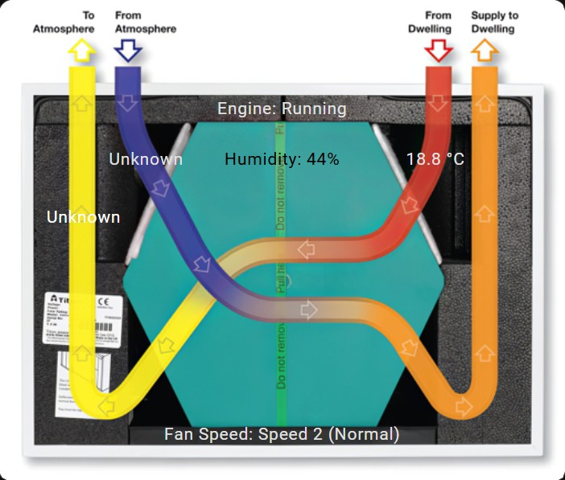

# Titon MVHR ESPHome Integration

[](https://esphome.io/)
[](https://www.home-assistant.io/)
[](https://opensource.org/licenses/MIT)

Control and monitor your Titon MVHR (Mechanical Ventilation with Heat Recovery) unit via Home Assistant using ESPHome and a D1 Mini with RS-485 adapter.

## Table of Contents

- [Features](#features)
- [Prerequisites](#prerequisites)
- [Hardware Requirements](#hardware-requirements)
- [3D Case Options](#3d-case-options)
- [Wiring Diagram](#wiring-diagram)
- [Communication Protocol](#communication-protocol)
- [Installation](#installation)
- [Configuration](#configuration)
- [Summer Bypass & SUMMERboost](#summer-bypass--summerboost)
- [Home Assistant Dashboard Card](#home-assistant-dashboard-card)
- [Known Limitations](#known-limitations)
- [Troubleshooting](#troubleshooting)
- [Home Assistant Automations](#home-assistant-automations)
- [Contributing](#contributing)
- [Acknowledgments](#acknowledgments)
- [References](#references)

## Features

- **Temperature Monitoring**: Read all three thermistors (Stale In, Stale Out, Fresh In)
- **Humidity Monitoring**: Internal humidity sensor readings
- **Fan Speed Control**: Switch between Speed 1 (Trickle), Speed 2 (Normal), Speed 3 (Boost), and Speed 4 (Purge)
- **Summer Bypass & SUMMERboost**: Control summer ventilation modes
- **Boost Inhibit (Night Mode)**: Prevent high-speed operation during quiet hours
- **Status Monitoring**: Engine running status, filter remaining time, runtime hours
- **Error Detection**: Monitor for fan errors, thermistor errors, EEPROM errors, and more
- **Heat Recovery Efficiency**: Calculated efficiency based on temperature readings (a work in progress!)
- **Home Assistant Dashboard Card**: Monitor all the main aspects of your MVHR unit at a glance using our dashboard card (Lovelace) template

## Background & Introduction

This project started in August 2022 when I [posted on the Home Assistant forum](https://community.home-assistant.io/t/heat-recovery-mvhr-integration-titon-beam-in-ireland-mechanical-ventilation-with-heat-recovery/454942/22) asking whether anyone had an integration for Titon (sold as Beam in Ireland) MVHR systems.

After experimenting with direct serial communication via USB to RS-485, I found the serial bus would crash within Home Assistant when there was a clash with data from the MVHR's Auramode Controller. In early 2025, I decided to use a D1 Mini with a TTL (UART) to RS-485 module instead. Now in January 2026, here's the result!

## Prerequisites

- Home Assistant (2024.1 or later recommended)
- ESPHome Device Builder Add-on installed in Home Assistant
- Basic soldering skills for wiring connections
- Familiarity with ESPHome device setup

## Hardware Requirements

| Component | Description |
|-----------|-------------|
| D1 Mini (ESP8266) | Main microcontroller - I used a generic model from AliExpress which worked fine |
| UART to RS-485 Converter | For serial communication with MVHR - another AliExpress purchase |
| Titon MVHR Unit | Compatible with BMS protocol - the model I have is Titon HRV10M Q+ (TP481B). The "B" is the key distinction for TPxxxB/BC/BE units |
| 2-wire cable | Connection between RS-485 converter and MVHR J9 port, mounted on the top of the Titon MVHR unit (a few screws need to be removed) |
| Home Assistant | To get real value out of this, I assume you are using Home Assistant - if not, I highly recommend it! |
| 3D Printed Case | There are a number of 3D printed cases available which house both the D1 Mini and the RS-485 board. See options below |

## 3D Case Options

I have not printed either of these yet but upon initial review, I suggest the following:

- [DIN rail mounting Case (via Printables)](https://www.printables.com/model/405333-esp-wemos-d1-mini-and-rs485-ttl-adapter-mounting-c)
- [Non-DIN mounted Case (via Maker World)](https://makerworld.com/en/models/510708-wemos-d1-esp32-case-for-esphome-for-deye#profileId-426791)

Below is an image of the hardware fully assembled within the Non-DIN case. I found out (the hard way) that it does not fit my D1 mini, so you have been warned! As you can see, I have detatable cables that can easily join with the MVHR connections but you may choose to wire these directly or another way. Also not pictured is the USB cable to power the D1 Mini (or similar ESP8266 microcontroller), which plugs in from the right hand side


## Wiring Diagram

Below is a reference diagram (repurposed from a different product). At a later stage, I will upload a specific image showing how it all looks when connected to the Titon MVHR unit. On the D1 Mini, you can probably use different GPIO pins but I suggest sticking with the below so you can copy the code verbatim.



```
D1 Mini          RS-485 Converter          Titon MVHR (J9)
---------        ----------------          ---------------
GPIO1 (TX) ----> TX
GPIO3 (RX) <---- RX
3.3V       ----> VCC
GND        ----> GND
                 A  ------------------>    A
                 B  ------------------>    B
```

> **Note**: The 12V terminal on the Titon MVHR unit board typically powers the unit's display controllers (such as the Auramode controller that I use). You only need the A & B terminals connected to your RS-485 board (A to A, and B to B) - do not directly connect this 12V to try and power the D1 Mini. There is probably a way to power the D1 Mini from the MVHR unit but that is out of scope for this project. For now, I'm just powering it using a USB cable and an old USB phone adapter.

## Note Regarding Existing Displays or Controllers

I use the Titon Auramode Controller (others are available including the Auralite HRV) but I found that the RS-485 bus would be busy with the polling (chattering) between it and the BMS controller, causing clashes with data sending/receiving, as I believe it's only half-duplex. Observing the bus using a USB to RS-485 adapter shows a lot of chatter, **SO I HIGHLY RECOMMEND DISCONNECTING THE EXISTING DISPLAY CONTROLLER** to ensure reliability. That's not to say that you may wish to plug in your existing controller now and then.

## Communication Protocol

The Titon MVHR uses a proprietary RS-485 protocol (note: it does not use Modbus):

| Parameter | Value |
|-----------|-------|
| Baud Rate | 1200 |
| Data Bits | 8 |
| Parity | None |
| Stop Bits | 1 |
| Handshaking | None |

### Command Format

Below are some technical details (thanks to the Titon BMS Manual) on how the system communicates with the Titon BMS Controller. You don't need to worry too much about this to get going - it's just useful for those who want to understand the "how" and "why", and who may wish to contribute or fork this repository.

**Read Command (12 bytes):**
```
AAA1+00000\r\n
│││││└────── Data (ignored for reads)
││││└─────── Polarity (+/-)
│││└──────── Read/Write (1=read, 0=write)
└└└───────── Address (000-999)
```

**Response (11 bytes):**
```
AAA+DDDDD\r\n
│││││└────── Data value (5 digits)
││││└─────── Polarity (+/-)
└└└───────── Address echo
```

### Available Addresses

| Address | Function | Notes |
|---------|----------|-------|
| 030 | Thermistor 1 (Stale In) | 0.1°C resolution (e.g., +00250 = 25.0°C) |
| 031 | Thermistor 2 (Stale Out) | 0.1°C resolution |
| 032 | Thermistor 3 (Fresh In) | 0.1°C resolution |
| 036 | Internal Humidity | 1% RH resolution |
| 060 | Runtime Hours | Total hours |
| 061 | Status Word | 16-bit status flags |
| 068 | Factory Reset | Write 21930 to reset |
| 151 | Speed 1 Switch | Write 1=ON, 0=OFF |
| 152 | Speed 3 Switch | Write 1=ON, 0=OFF |
| 154 | Speed 4 Switch | Write 1=ON, 0=OFF |
| 230 | Summer Bypass | Write 1=Enable, 0=Disable |
| 290 | SUMMERboost | Write 0=Enable, 1=Disable (note: inverted logic) |
| 326 | Boost Inhibit | Write 1=Enable, 0=Disable |
| 341 | Filter Remaining | Hours until filter change |

### Status Word (Address 061)

The status word is a 16-bit value where each bit indicates a specific status:

| Bit | Decimal | Status |
|-----|---------|--------|
| 0 | 1 | Supply Fan Error |
| 1 | 2 | Thermistor Error |
| 2 | 4 | Extract Fan Error |
| 3 | 8 | EEPROM Error |
| 4 | 16 | Switch 1 Active |
| 5 | 32 | Switch 2 Active |
| 6 | 64 | Switch 3 Active |
| 7 | 128 | LS1 Active |
| 8 | 256 | LS2 Active |
| 9 | 512 | Engine Error |
| 10 | 1024 | Switch Error |
| 11 | 2048 | Engine Running |
| 12 | 4096 | Thermistor 1 Error |
| 13 | 8192 | Thermistor 2 Error |
| 14 | 16384 | Thermistor 3 Error |
| 15 | 32768 | Humidity Sensor Error |

> **Example**: A value of 2048 means engine running, no errors. A value of 2049 means engine running + supply fan error.

## Installation

### 1. Upload and Compile the YAML Code

Upload the YAML file from this repository to your D1 Mini microcontroller using the ESPHome Device Builder Add-on for Home Assistant.

There are plenty of guides for setting up ESPHome devices such as the D1 Mini online or via the ESPHome website. I suggest creating a new device via the ESPHome Device Builder menu item in Home Assistant. Once you have it established with basic code and connectivity, edit the device and copy/paste in the code from this repository. Be sure to tweak it to your specific details (hostname, WiFi, etc.).

### 2. Create Secrets File

With any ESPHome project, I recommend creating a `secrets.yaml` file in your ESPHome directory so you're not always exposing your WiFi SSID and password directly in your project YAML file:

```yaml
wifi_ssid: "your_wifi_ssid"
wifi_password: "your_wifi_password"
```

### 3. Compile and Upload

Once everything is reviewed and auto-validated in ESPHome, upload your new code (wirelessly or directly via USB) to your D1 Mini as per the regular upload process (again, if you haven't done this before, there are numerous online tutorials which walk you through the process).

### 4. Add to Home Assistant

The device will be automatically discovered by Home Assistant. Navigate to **Settings → Devices & Services → ESPHome** to view and configure your new Titon MVHR controller!

## Configuration

### Basic Configuration

The YAML configuration included in this GitHub repository includes the following which you can tweak accordingly, but I recommend the below settings for simplicity:

```yaml
esphome:
  name: mvhr
  friendly_name: Titon MVHR

esp8266:
  board: d1_mini

uart:
  id: uart_mvhr
  tx_pin: GPIO1
  rx_pin: GPIO3
  baud_rate: 1200
  data_bits: 8
  parity: NONE
  stop_bits: 1
```

### Available Entities

#### Sensors
- Stale Air In Temperature
- Stale Air Out Temperature
- Fresh Air In Temperature
- Internal Humidity
- Runtime Hours
- Filter Remaining Time
- Heat Recovery Efficiency
- Status Word (raw)
- WiFi Signal Strength
- Uptime

#### Binary Sensors
- Filter Change Required
- Engine Running
- Supply Fan Error
- Extract Fan Error
- Thermistor Errors (1, 2, 3)
- Humidity Sensor Error
- EEPROM Error
- Engine Error

#### Switches
- Fan Speed 1 (Trickle)
- Fan Speed 3 (Boost)
- Fan Speed 4 (Purge)
- Boost Inhibit (Night Mode)
- Summer Bypass (planned)
- SUMMERboost (planned)

#### Text Sensors
- Current Fan Speed

#### Selects
- Fan Speed (dropdown selector) - this needs work. Note that Fan Speed 2 typically isn't an option as it's the default state (i.e., if you're in "Fan Speed 3" and turn this switch off, it will go to Fan Speed 2).

#### Buttons
- Poll Sensors Now
- Factory Reset MVHR

## Summer Bypass & SUMMERboost

### Summer Bypass
This diverts incoming fresh air around the heat exchanger to bring in cooler outside air (bypasses heat recovery). Useful for cooling your home with cooler air during the summer. I cannot say how effective this function is in general on an MVHR unit but better than nothing I guess!
The following link is a Titon Video which explains is in more detail: [Summer Bypass Video](https://www.youtube.com/watch?v=vutKbaCR4h8)

### SUMMERboost
Runs both supply and extract fans at high speed (Speed 4) for maximum fresh air exchange. Only activates when Summer Bypass is active.

> **Advanced Tip**: If you want independent control of SUMMERboost, disable it (write 1 to address 290) and use address 154 to control Speed 4 directly.

The following Titon Video explains SUMMERBoost in more detail: [SUMMERBoost Video](https://www.youtube.com/watch?v=o39tIwFmehI)

## Fan Speed Priority

The MVHR uses a "fastest speed wins" priority system:
- If an external boost switch holds the unit at Speed 3, setting Speed 1 via serial will have no effect
- The highest requested speed from any source will be active

## Home Assistant Dashboard Card

It's a work in progress but I have put together a nice picture card for Home Assistant, so you can see all the essential sensors.

- **Note:** In my example graphic below, I currently have 2 faulty sensors (hence why 2 values show as "unknown"!).
- **Note 2:** A copy of my template graphic is in the repository for reference.



```yaml
type: picture-elements
elements:
  - type: state-label
    style:
      top: 33%
      left: 26%
    entity: sensor.titon_mvhr_fresh_air_in_temperature
    title: Fresh Air in Temperature
  - type: state-label
    entity: sensor.titon_mvhr_stale_air_in_temperature
    style:
      top: 33%
      left: 77%
    title: Stale Air in Temperature
  - type: state-label
    entity: sensor.titon_mvhr_internal_humidity
    style:
      top: 33%
      left: 50%
      color: black
    title: Humidity
    prefix: "Humidity: "
  - type: state-label
    style:
      top: 45%
      left: 15%
      color: white
    entity: sensor.titon_mvhr_stale_air_out_temperature
    title: Stale Air Out Temperature
  - type: state-label
    style:
      left: 50%
      top: 90%
    entity: sensor.titon_mvhr_current_fan_speed
    prefix: "Fan Speed: "
  - type: state-label
    style:
      left: 50%
      top: 22.5%
    entity: binary_sensor.titon_mvhr_engine_running
    prefix: "Engine: "
image: /local/images/titon-mvhr-picture-card-template-blank.png
```

> **Note**: Update the `image` path to match where you store the background image in your Home Assistant configuration.

## Known Limitations

- **Boost button detection**: When pressing the physical boost button around the house, the project isn't updating the current speed sensor. I have it working in the next version but the boost is just a software timer, antisipating when the fan will return to Normal Speed (2). Not ideal, but it works I guess. Timer can be adjusted, depending on how long your boost lasts.
- **Filter remaining schedule**: I'm not convinced mine is accurate. I need to investigate further whether the "remaining months" value is something managed by the MVHR BMS controller/mainboard, or if it's managed by the Auramode (and similar) control panel(s).

There are other items which probably are not functioning but will be reviewed in due course. There are lots of comments left within the YAML file to explain what each section relates to, so to make it easier to search what you might be looking to tweak.

## Troubleshooting

### No Response from MVHR

1. **Check wiring**: Ensure A/B lines are correctly connected (try swapping if no response). Use the logging (details below) so you can see what commands are being sent and received. The YAML file is configured to ensure these messages are presented in a human-readable format for ease of diagnosing issues.
2. **Verify baud rate**: Must be exactly 1200
3. **Check for bus contention**: If using Auramode or other controller, it has continuous communication with MVHR BMS Controller - polling may conflict and so I recommend plugging our your existing controller such as an Auamode or Auralite.

### Error Response (999/-99999)

This indicates an invalid address or communication error. Verify:
- Address exists in the protocol table
- Command format is exactly 12 bytes
- CR+LF terminators are present
- In my MVHR unit, it transpires that 2 of my temperature sensors were responding with -99999 (via the ESPHome logs - reply messages). The guys on the Titon tech team suggested that I temporarily fitted a 10K resistor in the temperature positions on the Titon PCB (which should return a response of roughly "031+00250" or around 25 degrees) - and they were right. This indicated to me that my unit currently has 2 faulty temperature sensors :-(

### Intermittent Communication

- The Auramode controller (and others I'm sure) has almost continuous communication with the MVHR. Again, I recommend disconnecting other contollers to ensure more reliable communication.
- If you insist on having it connected, you may need to implement delays between commands to avoid bus contention (I think I removed a lot of code code from previous versions of YAML file which looked for gaps in communication).
- Consider longer polling intervals (5+ seconds)

### Debug Logging

Enabling debug logging in your ESPHome YAML file allows you to see raw communication - i.e., messages being sent to the Titon BMS controller and responses being received (which are formatted in an easy-to-read format):

```yaml
logger:
  level: DEBUG
  logs:
    uart: DEBUG
    mvhr: DEBUG
    mvhr_rx: DEBUG
```

## Home Assistant Automations

Below are some example Home Assistant automations to leverage the power of having Home Assistant integrated with your Titon/Beam MVHR system.

### Example: Night Mode Schedule

This will ensure that the system does not turn up the speed during the night and disturb your sleep.

```yaml
automation:
  - alias: "MVHR Night Mode"
    trigger:
      - platform: time
        at: "22:00:00"
    action:
      - service: switch.turn_on
        entity_id: switch.titon_mvhr_boost_inhibit_night_mode

  - alias: "MVHR Day Mode"
    trigger:
      - platform: time
        at: "07:00:00"
    action:
      - service: switch.turn_off
        entity_id: switch.titon_mvhr_boost_inhibit_night_mode
```

### Example: Humidity-Based Boost

In this example, if your humidity goes above 70%, Fan Speed 3 (boost) will kick in.

```yaml
automation:
  - alias: "MVHR High Humidity Boost"
    trigger:
      - platform: numeric_state
        entity_id: sensor.titon_mvhr_internal_humidity
        above: 70
    action:
      - service: switch.turn_on
        entity_id: switch.titon_mvhr_fan_speed_3_boost
```

### Example: Filter Replacement Notification

```yaml
automation:
  - alias: "MVHR Filter Alert"
    trigger:
      - platform: state
        entity_id: binary_sensor.titon_mvhr_filter_change_required
        to: "on"
    action:
      - service: notify.mobile_app
        data:
          title: "MVHR Filter Change Required"
          message: "Your MVHR filter needs replacing"
```

## Contributing

Contributions are very much welcomed! I hope there are others out there looking to do similar with their Titon/Beam MVHR system, so please feel free to submit a Pull Request or fork this repository.

## License

This project is licensed under the MIT License - see the [LICENSE](LICENSE) file for details.

## Acknowledgments

- The Titon Technical support team who gave me a few pointers along the way when I ran into some dead ends. Also to Titon for publishing details online of how their controller communicates so it can be leveraged by projects such as this!
- ESPHome community for the essential building blocks to make this possible
- Home Assistant community for the amazing home automation platform that many know and love. To see how much it has grown since my first use in 2018 is mind-blowing. Keep up the great work Paulus, Frenck, and team.
- Thanks to the comments on the Home Assistant Community Forums for keeping me motivated to get to this point. I know it has a bit to go yet so it's a start I guess!
- To [respawner](https://github.com/respawner) for sharing a similar project written in Python that connects directly via USB → RS-485 adapter and has a HACS integration. Check it out, it might suit your needs more.

## References

- [Home Assistant Community Forum (where this topic started)](https://community.home-assistant.io/t/heat-recovery-mvhr-integration-titon-beam-in-ireland-mechanical-ventilation-with-heat-recovery/454942/22)
- [Titon Home Assistant Integration - direct USB to HA using a USB to RS-485 adapter](https://github.com/respawner/hass_titon_controller_plugin)
- [Titon PCB Communication Protocol for BMS Manual](http://products.titon.com/wp-content/uploads/2025/03/BM893_Iss.01_PCB_Communication_Protocal_for_BS_V1_1-ENG.pdf)
- [ESPHome Documentation](https://esphome.io/)
- [Home Assistant ESPHome Integration](https://www.home-assistant.io/integrations/esphome/)

---

## Disclaimer

This project is something I have put together in my limited spare time. I am using AI initially to generate the logic in the YAML config file and when possible, I am reviewing the code to interrogate the logic being applied and testing the functionality is working as it should. While I welcome issues and will do my best to answer in my spare time, I am encouraging others to contribute to the YAML file and make this a better project for all that may wish to use it!

**This is an unofficial integration. Use at your own risk!** Modifying ventilation system settings incorrectly could affect your warranty, not to mention your indoor air quality!
